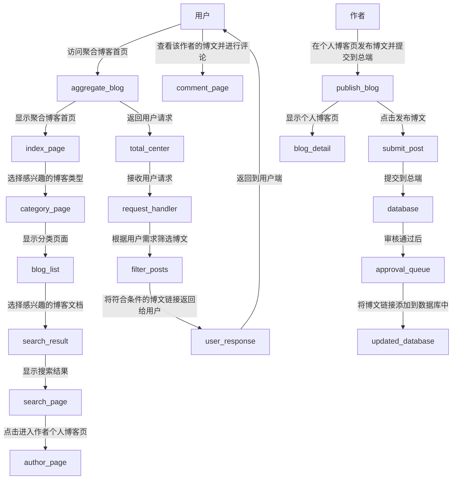

# 聚合博客项目

本项目是一个聚合博客项目，用于展示和分享不同但是有价值的博客。

## 背景

当今中文技术网络平台鱼龙混杂，如CSDN，博客园等，其中某些博客质量较高，但大部分博客无法给人提供更有价值的信息。
因此产生了聚合博客项目，用于将不同个人博客的博文聚合到一起，让用户可以快速找到自己感兴趣的优质博文。但是聚合博客项目对作者而言是一个要求较高的工作。它要求作者有较高的水平才能够发布文章。

## 目标

- **提高信息质量**：通过筛选高质量的博客文章，提升用户获取信息的质量。
- **简化搜索过程**：为用户提供一个统一的入口，减少在多个平台上搜索的时间。
- **促进知识共享**：激励更多作者创作高质量的内容，并提供一个展示平台。

## 功能特点

- **产品分为总端，个人博客页**：总端负责整合博客文章，分类，搜索等功能。个人博客页则负责展示用户的博文。用户通过在总端进行搜索，可以快速找到自己感兴趣的高质量博文。当用户想要查看某一博客文章时系统会将用户的请求转发到作者博客页。作者博客页由作者自己搭建，维护，总端提供博文评论等功能。 通过对作者能力的筛选以达到保证平台博客高质量的目标。
- **个人博客端，系统间快速交互**：通过RESTful API接口，将用户的请求转发到对应的博客页。以及使博客页与总端进行数据交互。

## 技术栈

- **前端**：使用Vue框架构建用户界面，提供良好的用户体验。
- **后端**：采用Kotlin语言与Spring Boot框架开发，确保系统的高效与稳定。
- **数据库**：使用MySQL存储文章数据及相关信息。

## 开发计划

1. **需求分析与设计**：明确项目需求，设计系统架构。
2. **环境搭建**：配置开发环境，包括前后端开发工具及数据库。
3. **功能开发**：
   - 前端页面设计与实现
   - 数据库表结构设计
   - 后端API接口开发
   - 个人博客端，系统总端数据交互接口
4. **测试**：进行单元测试、集成测试，确保各模块正常工作。
5. **部署上线**：将应用部署至服务器，进行线上测试。
6. **维护与迭代**：根据用户反馈持续优化产品功能。

## 流程

